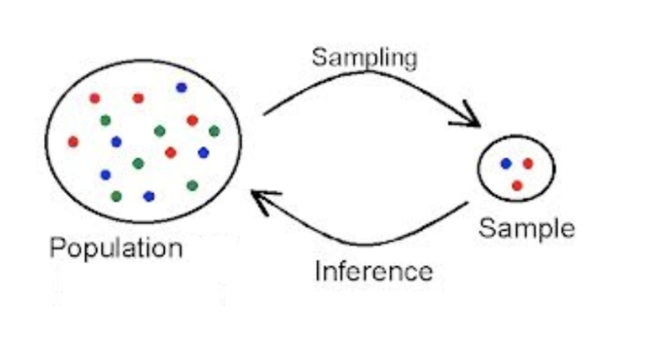

```{r setup, include=FALSE}
knitr::opts_chunk$set(echo = TRUE)
```


```{r,echo=FALSE}
require(shiny)
require(shinyjs)
require(tidyverse)
```

# 1. Introduction

Welcome to the simulation app! This app is intended for students who have some basic statistics knowledge and little to no knowledge of causal inference (R knowledge is optional). Throughout your simulation journey, we will cover several different topics using a hypothetical real-world example that will hopefully build your intuition and knowledge about the joys of simulation. One key thing to remember is that as you go through this app, you will have access to two very important hats: the _researcher_ hat, and the _omniscient_ hat. The _researcher_ hat is one you wear daily - you are in the real world, and have normal human limitations. However, every once in a while, you will get to wear the _omniscient_ hat, where you will transcend your feeble human mind and become an all-knowing and powerful being. These two hats are very important when we are simulating, and will come into play quite often throughout our journey. Ready? Okay, let's get started.

### Motivating Example
In New York State, there are a series of exams that high school students must take and pass in order to graduate. These are known as the Regents exams, and they cover a wide variety of topics such as Algebra, Global History, English, and Earth Science. Generally, the Global History regents is considered to be one of the most difficult, primarily due to the sheer amount of memorization students need to do (it is a traumatizing memory for this author). Students must score a 65 or higher to pass, but may re-take these exams as many times as necessary until they achieve their desired score.

You are an educational researcher tasked by the principal of a local high school to determine whether or not a new afterschool pilot program is effective in improving students' Global History regents scores. The high school has secured the participation of 100 students (out of 2,000), and you now turn to face your daunting task. 


### Where do we start?
Since this is a hypothetical example, we physically don't have the data. However, you have those two hats! Let's start with the _researcher_ hat, since you already have it on. 
You have a sample of 100 students, and must now randomly assign them into treatment and control groups. The treatment group will go through the new afterschool program, and the control group will receive normal tutoring. 

**HEIDI NOTE: At this point, I think we can either transition to the next section as shown below, or motivate a little more if necessary.**

# 2. What is probability

## 2.1 Random Variable and Probability Distributions



Suppose you're drawing students with pre-treatment regents test scores between 0 and 100 from high schools in New York state. When a student (let's call her Maggie) is drawn at random, the corresponding “random variable” is Maggie's pre-treatment score. If we repeat this process for Maggie, the probability of getting each possible score from the random variable is its distribution. Distributions are about the population. In this example, the probability distribution of the random variable (pre-treatment test scores) specifies the probabilities of all possible outcomes, such as the probability of a test score equaling 15, 65, 100, and so on.

You can think about any regular (deterministic) function like a box. For example, for the function $f(x) = x^2$, *every time* you give the function the value 2, it will *always* give you back 4. However, random variables are random functions that map the sample space (different students) into the real line (test score values between 0 and 100). This means that each time you apply the function it will give you a different number.


## Discrete and continuous random variable

There are two main types of random variables: _discrete_ and _continuous_.

- *Discrete random variables* can only take on a countable number of values (possibly infinite, but oftentimes finite). These are things like the number of Heads in two fair coin tosses, or the number of students assigned to a treatment condition.

> Treatments randomly assigned to a student (i.e., a binary variable of 0 or 1) or the proportion of 1 in the traetments randomly assigned to 100 students 

```{r, echo=FALSE}
fluidPage(
  actionButton("one_student_treatment", "Assign a student"),
  textOutput('one_student_treatment_plot')
)
observeEvent(input$one_student_treatment, {
  treatment <- rbinom(1,size = 1, prob = 0.5)
  student <- sample(students, size = 1)
  output$one_student_treatment_plot <- renderText(paste0(student, ': ', treatment))
})
```

```{r, echo=FALSE}
fluidPage(
  actionButton("hundred_student_treatment", "Assign 100 students"),
  plotOutput('hundred_students_treatment_plot')
)

df <- reactiveValues(treatment = c(0,0,0))

observeEvent(input$hundred_student_treatment, {
  df$treatment <- rbinom(100, size = 1, prob = 0.5)
  output$hundred_students_treatment_plot <- renderPlot(hist(df$treatment))
})
```


- *Continuous random variables* can take on any real number, an uncountable amount of possibilities (i.e., to any amount of decimal places).

> Example: pre-treament score of a student randomly drawn, or the mean of pre-treament scores of 100 students randomly drawn


```{r, echo=FALSE}
students <- c('James','Robert', 'John',
'Michael', 'William', 'David', 'Richard', 'Joseph', 'Thomas', 'Charles', 'Christopher', 'Daniel', 
'Matthew', 'Anthony', 'Mark', 'Donald', 'Steven', 'Paul', 'Andrew', 'Joshua', 'Kenneth', 'Kevin', 
'Brian', 'George', 'Edward', 'Mary', 'Patricia', 'Jennifer', 'Linda', 'Elizabeth', 'Barbara',
'Susan', 'Jessica', 'Sarah', 'Karen', 'Nancy', 'Lisa', 'Betty', 'Margaret', 'Sandra', 'Ashley',
'Kimberly', 'Emily', 'Donna', 'Michelle', 'Dorothy', 'Carol', 'Amanda', 'Melissa', 'Deborah')
fluidPage(
  actionButton("draw_a_student", "Draw a student"),
  textOutput('one_student_score')
)
observeEvent(input$draw_a_student, {
  score <- round(rnorm(1,60,15),2)
  student <- sample(students, size = 1)
  output$one_student_score <- renderText(paste0(student, ': ', score))
})
```

```{r, echo=FALSE}
fluidPage(
actionButton("draw_hundred_student", "Draw 100 students"),
plotOutput('hundred_students_scores')
)

df <- reactiveValues(score = c(0,0,0))

observeEvent(input$draw_hundred_student, {
  df$score <- rnorm(100,60,10)
  output$hundred_students_scores <- renderPlot({
    hist(df$score)
    abline(v = mean(df$score), col = 'blue')
    })
})
```


```{r, echo=FALSE}
causal_1 <- "A randomized experiment is performed within a survey. 1000 people are contacted. Half the people contacted are promised a $5 incentive to participate, and half are not promised an incentive. In one assignment of 1000 people to incentive or non-incentive groups, the result is a 50% response rate among the treated group and 40% response rate among the control group. If we randomly re-assign the 1000 people to the two groups, the response rate of each group changes. Therefore, in each re-assignment of the 1000 people, the response rate difference between two groups changes. "

shinyApp(
  ui = shinyUI(fluidPage(
    useShinyjs(), 
    actionButton("button", "Example in causal inference - Click Here"),
    hidden(
      div(id='text_div',
        textOutput("text")
        )
    )
  )
  ),
  server = function(input, output, session){
    observeEvent(input$button, {
      toggle('text_div')
      output$text <- renderText(causal_1)
    })

  }
)
```


# Page 2
## Normal Distribution

```{r, echo=FALSE}
# shinyApp(
#   ui = shinyUI(
fluidPage(
  tags$div(
    sliderInput('normal_size', label = "Sampel Size", min = 10, max = 5000, value = 50, step = 1),
    numericInput(inputId = "select_normal_mean", "Mean:", 0),
    numericInput(inputId = "select_normal_sd", "Standard Deviation:", 1, max = 100)
  ),
  plotOutput('normal'),
  tags$div(
    useShinyjs(),
    actionButton("show_code_normal", "Show me the R code of generating the distribution"),
    hidden(
      div(id='code_div_normal',
          verbatimTextOutput("code_normal")
      )
    )
  ))
# ),
# server = function(input, output, session){

output$normal <- renderPlot({
  tmp <- rnorm(n = input$normal_size, mean = input$select_normal_mean, sd = input$select_normal_sd)
  hist(tmp)
})
observeEvent(input$show_code_normal, {
  toggle('code_div_normal')
  output$code_normal <- renderText({
    paste0('rnorm(n = ', input$normal_size, ', mean = ', input$select_normal_mean, ', sd = ', input$select_normal_sd, ')')
  })
  
}
)
# }
# )
```

## Binomial Distribution
```{r, echo=FALSE}
inputPanel(
  sliderInput('binom_size', label = "Sampel Size", min = 10, max = 5000, value = 50, step = 1),
  numericInput(inputId = "select_binom_size", "number of trials:", value = 10, min = 1),
  numericInput(inputId = "select_binom_prob", "probability of success on each trial:", value = 0.5, min = 0, max = 1, step = 0.1)
)

renderPlot({
  tmp <- rbinom(n = input$binom_size, size = input$select_binom_size, prob = input$select_binom_prob)
  hist(tmp)
  })
```

## Poisson Distribution - **KEEP FOR NOW BUT CONSIDER REMOVING FOR ACTUAL LAUNCH - HC**

$p(x) = \lambda^x e^{\frac{-\lambda}{x!}}$


```{r, echo=FALSE}
inputPanel(
  sliderInput('pois_size', label = "Sampel Size", min = 10, max = 5000, value = 50, step = 1),
  numericInput(inputId = "select_pois_lambda", "Mean", value = 5, min = 0)
)

renderPlot({
  tmp <- rpois(n = input$pois_size, lambda = input$select_pois_lambda)
  hist(tmp)
  })
```


# Page 3
## Sampling Distribution
The sampling distribution is the set of possible datasets that could have been observed if the data collection process had been re-done, along with the probabilities of these possible values. 

The simplest example of a sampling distribution is the pure random sampling model: if the data are a simple random sample of size n from a population of size N, then the sampling distribution is the set of all samples of size n, all with equal probabilities.

The normal distribution, binomial distribution, and poisson distribution with specified parameters on the previous page are all sampling distributions for the samples of sizes of your choice.

> Say there are 10,000 NYU grad students and we randomly select 1000 students. Here we have population size of 10,000 and sample size of 1000. How many samples of size “n” are possible out of a population of size “N”? That's 10000 choose 1000, ${1000 \choose100}$, and the number is so large that even R only returns Inf.

```{r}
choose(10000,1000)
```


The next simplest example is pure measurement error: if observations $y_i$, i = 1,. . . , n, are generated from the model $y_i = a + bx_i + \epsilon_i$ , with fixed coefficients a and b, pre-specified values of the predictor $x_i$ , and a specified distribution for the errors $\epsilon_i$ (for example, normal with mean 0 and standard deviation $\sigma$), then the sampling distribution is the set of possible datasets obtained from these values of $x_i$ , drawing new errors $\epsilon_i$ from their assigned distribution.

```{r, echo=FALSE}
fluidRow(
  p("One continuous predictor: y = b0 + b1x + eps"),
  numericInput(inputId = "select_b0", "Intercept (b0):", 1),
  numericInput(inputId = "select_b1", "Coefficient on X (b1):", 0.5),
  numericInput(inputId = "select_sigma", "Residual Std Dev (sigma):", 1),
   sliderInput(inputId = "sample_size",label = "Select Sample Size",
    min = 10, max = 1000, value = 250, step = 10),
  plotOutput('regression'))

output$regression <- renderPlot({
  x <- seq(from = 1, to = 10, length.out = input$sample_size)
  y <- input$select_b0 + input$select_b1*x + rnorm(length(x), 0,input$select_sigma)
  df <- data.frame(x, y)
  ggplot(df, aes(x = x, y = y)) + geom_point() + geom_smooth(method='lm', formula= y~x,se = F) + theme_bw()
})

```


In practice, we will not know the sampling distribution; we can only estimate it, as it depends on aspects of the population, not merely on the observed data. In the pure random sampling model, the sampling distribution depends on all N datapoints. For the measurement-error model, the sampling distribution depends on the parameters a, b, and $\sigma$, which in general are not known, and will be estimated from the data. 


## Dependence
### Recognizing Conditional Probabilities
- “A blood test indicates the presence of a disease 95% of the time the disease is actually present”

> Translation: “P(test indicates disease | has disease)=0.95”

- “Males who have a circulation problem are twice as likely to be smokers as those who do not have a circulation problem.”

> Translation: “P(smoker | circulation problem)=2 P(smoker | no circulation problem)”

If the the probability of an event A is different from the conditional probability of A given a second event B, That is, $P(A|B) \neq P(A)$. Then we say that A and B are dependent. Another way to think about this is: knowing that B has occurred gives us different information about the probability of A also occurring than we have not knowing anything about B.
- Examples of dependent events:

> A: Wearing sunscreen and B: Eating ice cream 

> A: Midterm score and B: Pass the course or not

* Note that dependent events are not necessarily causally related.

```{r, echo=FALSE}
shinyApp(
  ui = shinyUI(fluidPage(
    useShinyjs(), 
    actionButton("show_code_sunscreen", "Show me the R code for the sunscreen example"),
    hidden(
      div(id='code_div_sunscreen',
        verbatimTextOutput("code_sunscreen")
        )
    ),
    actionButton("show_code_midterm", "Show me the R code for the midterm example"),
    hidden(
      div(id='code_div_midterm',
        verbatimTextOutput("code_midterm")
        )
    )
  )
  ),
  server = function(input, output, session){
    observeEvent(input$show_code_sunscreen, {
      toggle('code_div_sunscreen')
      output$code_sunscreen <- renderText( 
        paste0('sunscreen <- rbinom(10, size = 1, prob = 0.6)', '\n',
'ice_cream <- rbinom(10, size = 1, prob = (sunscreen + 0.1)*0.8)'))
    })
    observeEvent(input$show_code_midterm, {
      toggle('code_div_midterm')
      output$code_midterm <- renderText(
        paste0('midterm <- runif(10, min = 10, max = 95)','\n',
'p <- exp(midterm*0.01)/(1+exp(midterm*0.01))', '\n',
'final <- rbinom(10, size = 1, prob = p)')
      )
    })

  }
)
```

What happens if knowing B gives us no new information about A? Independent events are events that do not affect each other

> A: It is Monday and B: It is raining outside

> A: I eat oatmeal for breakfast and B: I am wearing jeans.

## Simulation

Simulation of random variables is important in applied statistics for several reasons. 
First, we use several probability models to mimic variation in the world, and the tools of simulation can help us better understand how this variation plays out. 

Second, we can use simulation to approximate the sampling distribution of data and propagate this to the sampling distribution of statistical estimates and procedures. 

Third, regression models are not deterministic; they produce probabilistic predictions. Simulation is the most convenient and general way to represent uncertainties in forecasts. 

In this final section, we will use what we learned and simulated in the previous sections to answer the question you were initially tasked with at the beginning: Is the afterschool program effective in improving high school students' scores on the Global History regents exam? Remember that _omniscient_ hat? It's time to put it on.

As with any simulation study, we need to first establish our **Data Generating Process (DGP)**. This means explicitly stating how you will be generating all of the data you need to estimate the treatment effect later on. For the purposes of this study, we will use what we learned in previous sections to walk through our DGP. 

### DGP

#### 1. Treatment Assignment
We already know how to generate treatment assignments from [section 2] using the Binomial distribution. The probability of assignment will be _0.5_.:
[RSHINY/CODE]

#### 2. Generating pre-treatment test scores
We also know that we can use the Normal distribution from [section 2] to generate our pre-treatment test scores. Remember: these are the original test scores of all the students prior to any of them attending the afterschool program.
[RSHINY/CODE]

#### 3. Generating outcome test scores based on treatment assignment
Here we start to make good use of our omniscient hat. As omniscient beings, we know that the treatment effect (or \tau) is **5**. That is, we know that the post-treatment test scores of students who went through the afterschool program is on average **5** points higher than the students who did not. To generate these outcome scores, we would simulate a _dependency_ based on the treatment assignment variable from above:
[RSHINY/CODE showing Y0 and Y1 based on treatment assignment]

### Calculating the Average Treatment Effect (ATE)
Note that we use "calculating" instead of "estimating". This is intentional, and is meant to illustrate the difference in process when you are wearing the omniscient hat versus the researcher hat. Specifically, as a researcher, you are always _estimating_ the ATE (or any other estimand) because we will never know the truth (in this case, that the treatment effect is 5). But when you are simulating and omniscient, you will always be calculating, since you know the true treatment effect. [<--**NEEDS WORK - HC**] 

Once we have simulated all the data necessary from our DGP, we can finally move on to calculating our estimand of interest:
[RSHINY/CODE showing ATE]
